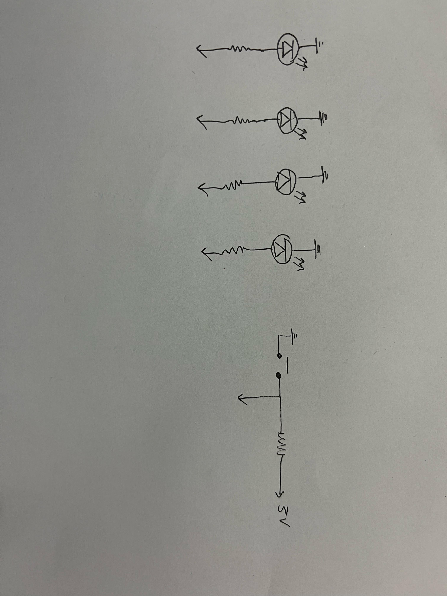
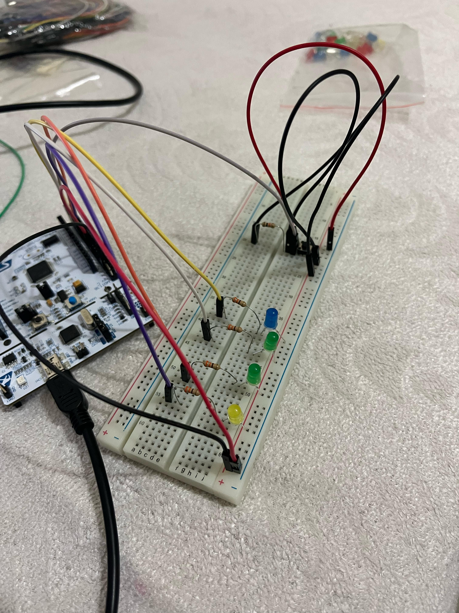
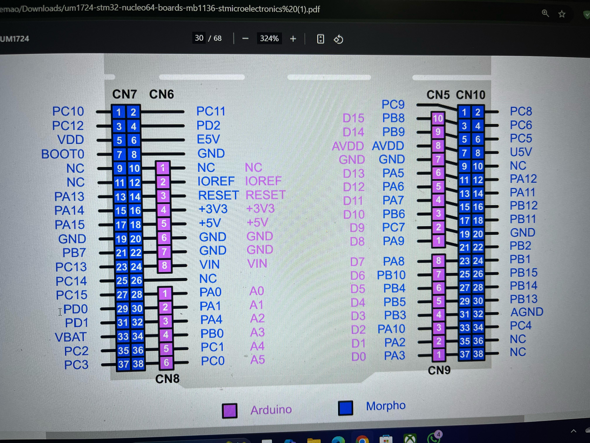
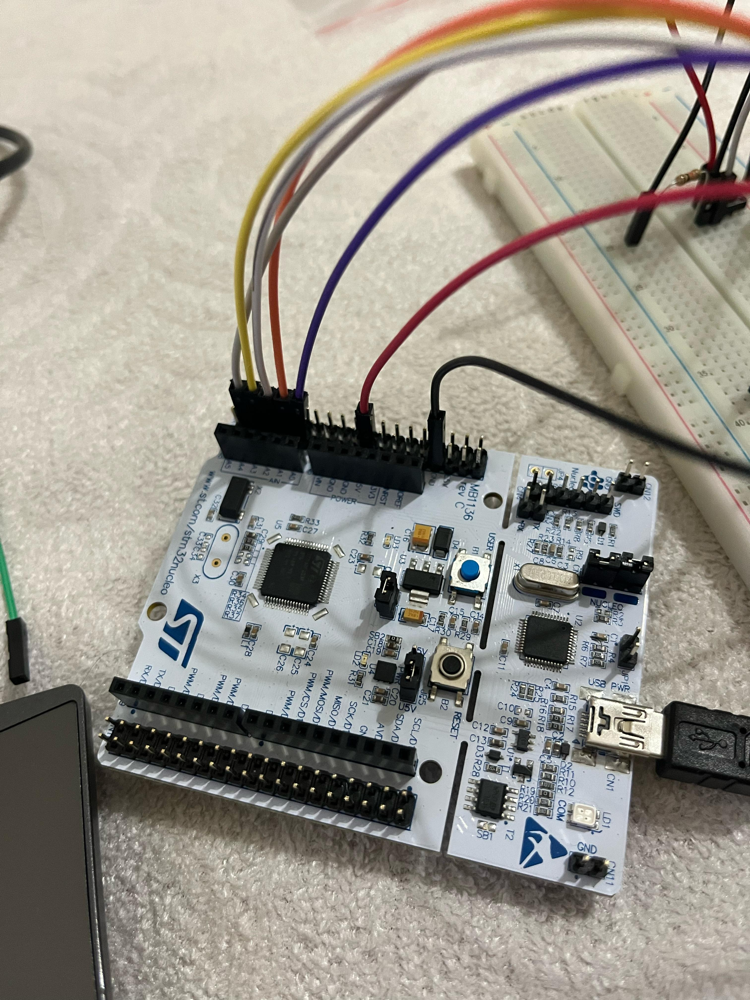

"# STM32 CubeMX Projesi" 

Bu proje, **STM32 Nucleo-F103RB** kullanarak **buton ile sıralı LED kontrolü** sağlamaktadır.  
Her butona basıldığında **bir sonraki LED yanar** ve diğerleri söner.

## 🛠 Kullanılan Donanım
- **STM32 Nucleo-F103RB**
- **4 Adet LED**
- **1 Adet Buton**
- **220Ω Dirençler**

## 📜 Kod Açıklaması
- `main.c` içinde **buton basıldığında LED sıralı olarak değişir**.
- STM32CubeMX kullanılarak **PA0, PA1, PA4, PB0, PC1 pinleri** giriş ve çıkış olarak yapılandırılmıştır.

## 📸 Devre Şeması
Aşağıda devre şeması bulunmaktadır:

## 🚀 Projeyi Çalıştırma
1. STM32CubeIDE ile projeyi aç.
2. Kartı **USB ile bilgisayara bağla**.
3. Derleyip karta yükle.

---

### **3.  
📌 *

